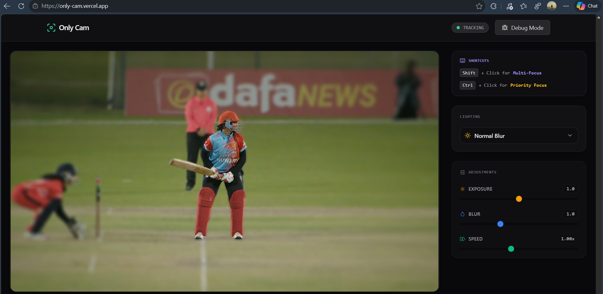
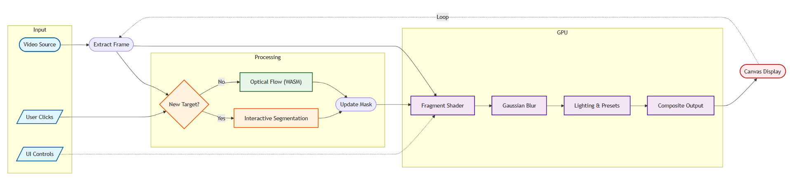
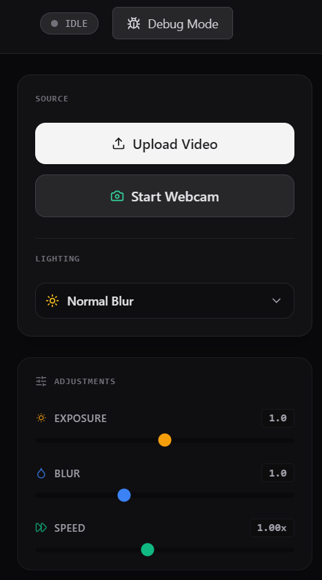

# Only Cam - Browser-native Cinematic Depth of Field



Built specifically to demonstrate the bleeding-edge capabilities of WebAssembly (WASM) and hardware-accelerated WebGL. Only Cam is a privacy-first, zero-latency web application that brings professional cinematic depth-of-field routing and real-time subject segmentation directly into the browser. 

## Architecture & Philosophy

This application shatters the common misconception that heavy computer vision tasks require dedicated Python backends or expensive GPU cloud compute. By strictly relying on the browser's execution context, Only Cam achieves what traditionally requires bulky desktop software like OBS or costly cloud APIs.

* **Zero-Latency & Privacy First:** No backend servers. No cloud APIs. No round-trip websocket delays. Your video stream never leaves your device, ensuring total privacy and instant visual feedback.
* **Pushing Browser Limits:** Demonstrates the bleeding-edge capabilities of modern web browsers using hardware-accelerated WebGL for pixel manipulation and WebAssembly for CPU-intensive algorithms.
* **Immediate User Value:** Instantly solves a complex problem (dynamic video depth-of-field manipulation and tracking) using state-of-the-art AI without complex installations or dependencies. Just click a link, grant webcam access, and you're rolling.

## The Power of WebAssembly (WASM)



At the core of Only Cam's performance is our heavy reliance on WebAssembly. WASM is the architectural pillar that makes real-time 60fps tracking possible on the web:

1.  **Near-Native Performance in JS Context:** By compiling performance-critical C++ (OpenCV) and Rust algorithms to WASM, we bypass JavaScript's garbage collection and JIT compilation overhead. The math-heavy optical flow point tracking runs with near-native execution speed directly in the browser tab.
2.  **Write once, run anywhere:** The beauty of WASM is its universality. The *same* compiled binary runs flawlessly on Windows, macOS, Linux, Android/iOS and modern mobile browsers without requiring complicated native OS builds or App Store gatekeeping.
3.  **Ecosystem Portability:** WASM allows us to leverage decades of C++ research in computer vision (via OpenCV) without needing to rewrite thousands of lines of code into vanilla JavaScript.

## Tech Stack

* **Frontend UI:** Vanilla JavaScript, HTML5, Tailwind CSS, Lucide Icons.
* **Intelligence & ML:** MediaPipe Tasks Vision (Interactive Segmentation).
* **Computer Vision (WASM):** OpenCV.js (WebAssembly compile) for highly optimized Lucas-Kanade optical flow tracking.
* **Rendering (GPU):** Pure WebGL for high-performance, real-time video compositing, shader injection, and blurring.

## Core Functionality


* **Interactive AI Segmentation:** Point-prompted target isolation using incredibly lightweight models running locally via MediaPipe. Click an object, and the AI maps its boundaries instantly.
* **Real-Time Optical Flow Tracking:** Once segmented, the subject is tracked seamlessly as it moves across frames using injected OpenCV WASM, drastically reducing the need to re-run expensive AI inference on every single frame.
* **Multi-Focus (Shift+Click):** Set A/B points to instantly interpolate the depth map and keep multiple subjects in focus while blurring the rest.
* **Priority Focus Queue (Ctrl/Cmd+Click):** Build a sequence of focus targets for complex racking shots.
* **Advanced WebGL Rendering:** Real-time depth-aware Gaussian blur, exposure sliders, and environmental lighting presets (Warm, Cool, Vignette, Spotlight) are computed per-pixel on the GPU.

## Browser Compatibility

To ensure real-time performance, Only Cam relies on modern web APIs. 
* **Recommended Browsers:** Any latest versions.
* **Requirements:** Hardware acceleration accelerates WebGL rendering.

## How to Run Locally

Since this is a client-side only application, getting started is practically instant.

1.  Clone the repository.
2.  Navigate to the `client` directory.
3.  Serve the directory using any local web server. For example:
    ```bash
    npx serve .
    # or
    python3 -m http.server 3000
    ```
4.  Open `http://localhost:3000` in your browser.
5.  Upload a video file or click **Start Webcam** to begin.

[**Launch the Online Demo**](https://only-cam.vercel.app)

## Usage Guide

1.  **Select Source:** Upload a video of your choice or use your webcam.
2.  **Single Focus:** Click anywhere on the video to snap focus to that object. The background will immediately blur.
3.  **Multi-Focus:** Hold `Shift` and click two different subjects to keep both in focus.
4.  **Cinematic Presets:** Use the dropdown below the video to change lighting (e.g., Warm Studio, Cool Night).
5.  **Adjustments:** Play with the sliders (Exposure, Blur Strength, Speed) for real-time adjustments.

---
*Built for the 24-Hour Pragyan Khel Hackathon.*